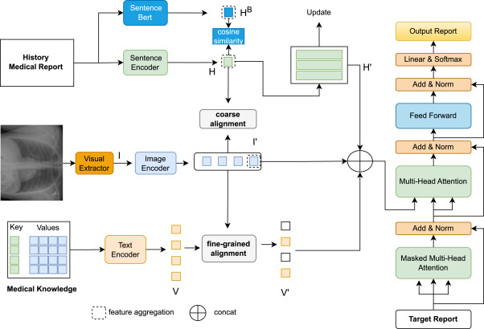
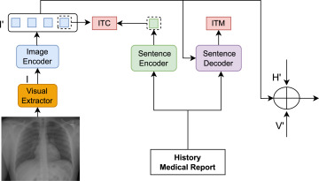

# CS550 Machine Learning (2024-25-M Semester)


## Project Phase 3 : Project Report Submission


### Group Details 

- Group Name : BugFixers
- Group Members :
    - Manopriya Mondal
    - Ragini Vinay Mehta
    - Shivangi Gaur


### Cloning the Repository

```
git clone https://github.com/RaginiMehta/CS550_ASMT_MRSMK
```


### Repository Structure

```
|-- CS550_ASMT_MRSMK
    |-- .git
    |-- .gitignore
    |-- README.md
    |-- MRSMK.ipynb
    |-- datasets
        |-- iu_xray
            |-- input
            |   |-- images
            |   |   |-- <Files>
            |   |-- reports
            |       |-- ecgen-radiology
            |           |-- <Files>
            |-- output
```


### Technologies Used :

- Programming Language
	- Python
- Frameworks and Libraries
	- PyTorch
	- Pillow
	- OpenCV
	- Scikit Learn
	- HuggingFace


<br>


## Project Report : Medical Report Summarisation using Medical Knowledge


### Problem Statement

Radiologists face substantial challenges due to the complexity and volume of medical images, often resulting in inconsistent diagnostic accuracy and potential misdiagnoses. The inadequate integration of medical knowledge further exacerbates these issues. This underscores the need for advanced methods to enhance the effectiveness and reliability of medical image analysis, addressing cognitive load and improving report accuracy. 

Thus, we aim to achieve the following using Machine Learning :
- Maintaining Diagnostic Accuracy
- Handling Complex Medical Reports
- Addressing Data Bias and Imbalance
- Enhancing Integration of Medical Knowledge


### Approach and Methodology






#### Overall Architecture
- The proposed framework comprises visual extraction, knowledge enhancement (MKE), and multilevel alignment (MIRA), as shown in Figure 1.
- The visual extraction module reads one or more radiological images and obtains the image feature encoding by image embedding, while the text encoder and sentence encoder read medical knowledge and doctors' reports and encode them into sequential information.
- The text information is aligned with the visual information at multiple levels, and then the knowledge and visual information are combined and sent to the decoder to generate the report.


#### Basic Module
- The **encoder–decoder** construction in the network is modeled after the **self-attention architecture** in the Transformer, and the main part contains **multi-head attention (MHA)** and a **feed-forward network (FFN)**.
- **Multi-Head Attention (MHA)**
```math
Att_i (X, Y) = softmax \left( \frac{X W_i^Q (Y W_i^K)^{\top}}{\sqrt{d_m}} \right) Y W_i^V
```
```math
MHA (X, Y) = [Att_1 (X, Y) ; \dots ; Att_n (X, Y)] W^O
```
where \$n\$ denotes the number of heads in the multi-head attention; \$X \in \mathbb{R}^{l_x \times d}\$ and \$Y \in \mathbb{R}^{l_y \times d}\$ denote the Query matrix and the Key/Value matrix, respectively; \$W_i^Q, W_i^K, W_i^V, W^O\$ are learnable parameters, where \$d_m = d / n\$. 
- **Feed-Forward Network (FFN)**
```math
FFN (x) = ReLU(x W_f + b_f) W_{ff} + b_{ff}
```
- There is a dropout, residual connection, and layer normalization structure in the middle of the MHA and FFN. In the above equation, parameter **ReLU** represents the **activation function**; \$W_f\$ and \$W_{ff}\$ are learnable matrices; \$b_f\$ and \$b_{ff}\$ are bias terms.


#### Visual Extractor
- The image information is extracted using **ImageNet pre-trained ResNet101** as our visual backbone.
```math
I = ResNet (Img), I ∈ ℝ^{s*k}
```
where \$s\$ and \$k\$ denote the number of visual feature channels and the dimensionality of the visual features, respectively.
- The extracted information is transformed into **patches** through the visual backbone.
- An **image encoder** is used to obtain the image embedding.
- An **average pooling layer** is used to process the image encoding.
- The **final image embedding** is obtained by concatenating the image encoder result with the pooling result.


#### Knowledge Enhancement
1. **Text Encoder for Medical Knowledge using Medical Dictionary**
- A **medical dictionary** is created where each entry has an **organ part** as the key and its **associated medical conditions** as values, connecting topics to their corresponding abnormal states and pathological expressions. 
- Medical reports are complex, and not all dictionary knowledge is relevant to a specific image. Thus, **image-text alignment** is crucial to identify relevant knowledge for image analysis and report generation. 

2. **Sentence Encoder for Historical Knowledge using Medical Reports**
- The **Sentence Encoder** encodes historical medical reports, and to effectively utilize historical knowledge, we need to ensure uniformity in the encoding of similar reports, in which traditional sentence encoders may not excel at.
- Thus, to achieve uniformity in report encodings, we utilize the **pre-trained Sentence-BERT** for encoding the reports and subsequently calculate the **cosine similarity** between these encodings. We do not employ the Sentence-BERT encodings directly, as they do not align with the information in our model and lack contextual relevance.
- We leverage this **similarity score** as a label to **train our Sentence Encoder**, with the expectation that similar reports will be encoded in a similar manner.
- We also created a storage matrix to store the encoding of historical reports, and the stored information was historical knowledge. The **stored historical knowledge** is constantly updated with the training in the form of queues.
```math
H_i = SentenceEncoder(R_i)
```
```math
H_i^B = Sentence-Bert(R_i)
```
```math
L_h = 1/m * Σ_(i=1)^m (cos_sim(H_i^B) - cos_sim(H_i))^2
```
where R₁ denotes the report, m is the number of reports, H, denotes the encoding result of SentenceEncoder, H denotes the encoding result of Sentence-BERT, and cos_sim indicates the cosine similarity.
- Our method employs images to retrieve historical reports through cosine similarity scores. These **N most similar reports** are chosen to serve as our **historical knowledge base**. The model leverages historical knowledge to compensate for the absence of image-related information, thereby enhancing the quality of report generation.
- However, multilevel alignment was critical to bridge the **modal difference between image and sentence encodings**, which was leading to deterioration in the image encoding's query with the most similar historical knowledge.


#### Multilevel Alignment
- To improve the interaction between text and image modalities, we designed a **multilevel alignment** approach, progressing from **coarse to fine** and **whole to local** alignment. This method integrates textual knowledge more effectively and removes irrelevant information, while preserving potential anomaly candidates to enhance the model's anomaly detection and reduce data bias.
- We employed the **BLIP architecture** for overall image-text alignment, incorporating two task goals: **Image-Text Contrastive (ITC)** and **Image-Text Matching (ITM)**. ITC aligns visual features by making positive image-report pairs have similar representations, while ITM classifies whether image-report pairs match or mismatch. The overall alignment, however, was too coarse to capture local details of image regions corresponding to described parts in medical reports.
```math
L_a = L_ITC + L_ITM
```
- To address this, we introduced the Alignment module, where we used **dictionary knowledge to map medical report terms to local image regions**. This approach, akin to anchor boxes in object detection, allowed us to align visual regions with relevant dictionary knowledge.
- The alignment process uses a **self-attentive mechanism**, where local image regions are fine-grained and aligned with dictionary terms. Unrelated knowledge is filtered out during training by searching for matching keywords in the report and excluding non-relevant information. The dictionary knowledge is encoded with the text encoder, and the results are passed through the alignment module for local alignment.
- For **local alignment training**, we followed a VAE-inspired approach, converting the encoded results into a normal distribution with mean (µ) and variance (σ²). We minimized their KL divergence between the two distributions to optimize alignment, as shown in the equations:
```math
V' = Text Encoder (R_{MK})   
```
```math
V' = FFN(MEA(V, I')) 
```
where RMK is the dictionary knowledge, and V' denotes the dictionary embedding. The knowledge V' is generated using the image embedding V as a query to find the corresponding knowledge in the image.
For local alignment training, we define the prior distributions as:
```math
V_{label} = Text Encoder (R'_{MK})   
```
```math
µi, σi² = Prior (V); µi', σi'² = Prior (V_{label}) 
```
- The **KL divergence loss** is then calculated as:
```math
L_{KL} = {KL}\left(\mathcal{N}(\mu_1, \sigma_1^2) \parallel \mathcal{N}(\mu_2, \sigma_2^2)\right) = \sum \mathcal{N}(\mu_1, \sigma_1^2) \log\left(\frac{\mathcal{N}(\mu_1, \sigma_1^2)}{\mathcal{N}(\mu_2, \sigma_2^2)}\right)
```


#### Report Generator

- We employed the standard decoder of the Transformer to generate medical reports.
```math
Rₜ = Decoder(concat(I', V', H', Rₜ₋₁), R₀ = 0)
```
where I', V', H' represent the aligned images, medical dictionary knowledge, and screened historical knowledge, respectively; Rₜ is the report generated at time t. 
- Finally, the entire model was optimized by the negative conditional log-likelihood of p(R) given the image as well as the knowledge that:
```math
Lᵣ = Σₜ₌₀ᵀ log pθ(Rₜ | R<ₜ, Img, MK, HK)
```
```math
L = Lᵣ + Lₐ + Lₕ + Lₖₗ
```
where Img, MK, and HK are image information, medical dictionary knowledge information, and historical knowledge information, respectively, while L is the sum of the above four losses. 


### Results

